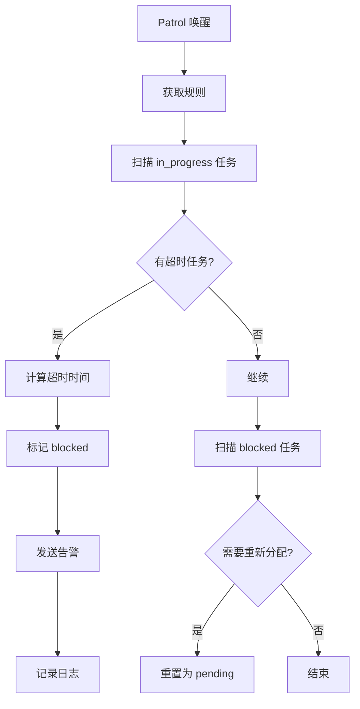
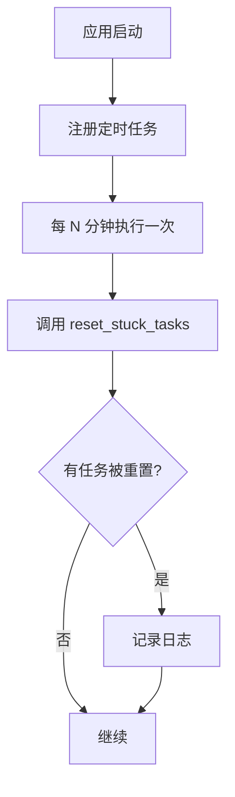

# Agent 任务未提交问题分析与解决方案

## 问题概述

| 任务 | Agent | 问题 |
|------|-------|------|
| 设计主要角色 | 后端开发者 | 未调用 submit |
| 规划剧情大纲 | 后端开发者 | 未调用 submit |
| 撰写前10章 | 后端开发者 | 未调用 submit |

## 问题根源分析

```
┌─────────────────────────────────────────────────────────────────┐
│                      任务状态流转图                              │
├─────────────────────────────────────────────────────────────────┤
│                                                                 │
│  pending → assigned → in_progress → review → done              │
│                      ↑        ↑                                 │
│                      │        │ (缺少 submit 调用)               │
│                      │        │                                 │
│                      └────────┴── (卡住! 永远无法到达 review)    │
│                                                                 │
└─────────────────────────────────────────────────────────────────┘
```

### 根本原因

1. **Agent 执行流程不完整**
   - [`backend-developer-executor.md:92-94`](OpenMOSS/prompts/role/backend-developer-executor.md:92) 中明确规定了提交步骤：
     ```
     9. **提交时**：
        - `log create "delivery" "交付物：<文件路径>..."` — 先写交付摘要
        - `st submit <id>` — 再提交
     ```
   - Agent 可能因为各种原因跳过这一步：
     - 执行过程中断（API 超时、网络问题）
     - Agent 理解偏差，认为完成工作就算结束
     - 长任务执行中忘记提交

2. **巡查机制不足**
   - [`task-patrol-skill/SKILL.md:32`](OpenMOSS/skills/task-patrol-skill/SKILL.md:32) 只查询：
     ```bash
     st list --status in_progress  # 检查是否超时/卡住
     ```
   - 巡查发现了 `in_progress` 任务，但没有自动处理机制
   - 缺少主动重置超时任务的自动化

3. **缺乏超时保护**
   - [`sub_task_service.py:307-345`](app/services/sub_task_service.py:307) 有 `reset_stuck_tasks` 函数，但：
     - 需要手动调用，没有集成到系统中
     - 没有定时任务触发它

## 解决方案

### 方案一：增强巡查 Skill（推荐）

**思路**：让 Patrol Agent 具备超时任务自动处理能力



**修改文件**：
- [`OpenMOSS/skills/task-patrol-skill/SKILL.md`](OpenMOSS/skills/task-patrol-skill/SKILL.md)

**新增命令**：
```bash
# 在 SKILL.md 中添加超时重置功能
st reset-timeout <sub_task_id>              # 手动重置超时任务
st reset-timeout --all --minutes 30         # 重置所有超30分钟的任务
```

### 方案二：增加后端定时任务

**思路**：在 FastAPI 应用中添加后台定时任务，自动重置超时任务



**修改文件**：
- [`app/main.py`](app/main.py) - 添加后台任务
- [`app/services/sub_task_service.py`](app/services/sub_task_service.py) - 已有 `reset_stuck_tasks`，确认调用方式

### 方案三：强化 Agent Prompt

**思路**：在 Agent 的执行 prompt 中更强调提交的重要性

**修改文件**：
- [`OpenMOSS/prompts/role/backend-developer-executor.md`](OpenMOSS/prompts/role/backend-developer-executor.md)
- 其他 Executor role prompt

**添加内容**：
```markdown
## ⚠️ 关键提醒：完成任务必须提交

无论任务大小，完成工作后**必须**调用 `st submit <id>` 提交成果。

不提交的后果：
- 任务永远卡在 in_progress
- 巡查会标记为异常并扣分
- 影响团队任务流转

如果忘记提交，巡查 Agent 会帮你标记 blocked 并扣分！
```

## 推荐方案组合

| 方案 | 优先级 | 实施难度 | 效果 |
|------|--------|----------|------|
| 方案二（定时任务） | P0 | 低 | 彻底解决超时卡住问题 |
| 方案一（增强巡查） | P1 | 中 | 提升系统鲁棒性 |
| 方案三（强化 Prompt） | P2 | 低 | 减少人为失误 |

## 实施计划

### Step 1：立即修复（P0）

在 [`app/main.py`](app/main.py) 中添加定时任务，每 5 分钟检查一次超时任务：

```python
from fastapi import FastAPI
from apscheduler.schedulers.asyncio import AsyncIOScheduler

scheduler = AsyncIOScheduler()

@app.on_event("startup")
async def start_scheduler():
    scheduler.add_job(reset_stuck_tasks, "interval", minutes=5)
    scheduler.start()

# 移除 reset_stuck_tasks 的 agent_id 参数
# def reset_stuck_tasks(db: Session, timeout_minutes: int = 30) -> int:
```

### Step 2：增强巡查（P1）

修改 [`OpenMOSS/skills/task-patrol-skill/SKILL.md`](OpenMOSS/skills/task-patrol-skill/SKILL.md)，添加自动处理超时任务的逻辑。

### Step 3：强化提示（P2）

更新所有 Executor prompt，强调提交的重要性。

## 实施状态

### ✅ 已完成

1. **方案一：后端定时任务**
   - 在 [`app/main.py`](app/main.py) 中添加了后台定时任务
   - 每 5 分钟检查一次超时任务（默认 30 分钟超时）
   - 自动将超时的 `in_progress` 任务重置为 `pending`

2. **方案三：强化 Agent Prompt**
   - 在以下文件中添加了禁止事项提醒：
     - [`OpenMOSS/prompts/role/backend-developer-executor.md`](OpenMOSS/prompts/role/backend-developer-executor.md)
     - [`OpenMOSS/prompts/role/frontend-developer-executor.md`](OpenMOSS/prompts/role/frontend-developer-executor.md)
     - [`OpenMOSS/prompts/role/content-creator-executor.md`](OpenMOSS/prompts/role/content-creator-executor.md)
     - [`OpenMOSS/prompts/role/testing-engineer-executor.md`](OpenMOSS/prompts/role/testing-engineer-executor.md)
     - [`OpenMOSS/prompts/role/ai-xiaoke-executor.md`](OpenMOSS/prompts/role/ai-xiaoke-executor.md)
     - [`OpenMOSS/prompts/role/ai-xiaowu-executor.md`](OpenMOSS/prompts/role/ai-xiaowu-executor.md)
     - [`OpenMOSS/prompts/role/ai-jianggua-executor.md`](OpenMOSS/prompts/role/ai-jianggua-executor.md)
   - 新增禁止事项：`❌ **不要忘记调用 `st submit`** — 完成工作后必须提交成果，否则任务永远卡住！`

### 技术实现细节

```python
# app/main.py 中的定时任务配置
STUCK_TASK_CHECK_INTERVAL = 300  # 每 300 秒（5分钟）检查一次
STUCK_TASK_TIMEOUT_MINUTES = 30  # 超过 30 分钟视为超时
```

### 待优化（后续可选）

1. **超时时间可配置化**：将超时阈值移到 config.yaml 中
2. **重置时发送通知**：任务被重置时通知原 Agent
3. **增加 Agent 扣分机制**：多次超时重置的 Agent 进行扣分

